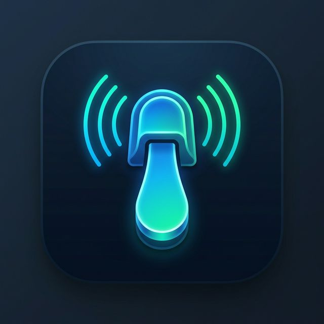

# 🎹 My Pedal - Virtual Sustain Pedal



**My Pedal** transforms your mobile device into a high-performance virtual sustain pedal for your PC. It is specifically designed to work seamlessly with **Everyone Piano**, but can be used with any software that supports a sustain pedal mapped to the **Right Alt (AltGr)** key.

---

## 🚀 How It Works

1.  **Flutter Mobile App**: A sleek, premium Android client that detects your touch and transmits "Pedal Down" and "Pedal Up" commands.
2.  **Python PC Server**: A lightweight background server that receives these commands via UDP and simulates a physical **Right Alt** key press on your system.
3.  **Everyone Piano Integration**: With "Everyone Piano" configured to use Right Alt for sustain, your mobile device becomes a real pedal!

---

## ✨ Features

-   **Zero-Config Discovery**: The mobile app automatically finds your PC on the local network using UDP broadcasting.
-   **Ultra-Low Latency**: Uses UDP protocol for near-instantaneous pedal response.
-   **Premium Aesthetics**: Modern, minimalist dark mode UI with haptic feedback and smooth animations.
-   **Reliable Connection**: Built-in reconnection logic and status monitoring.

---

## 🛠️ Setup Guide

### 1. PC Server (Windows)

The server requires Python and the `pynput` library to simulate key presses.

1.  **Install Dependencies**:
    ```bash
    cd Server
    pip install -r requirements.txt
    ```
2.  **Run the Server**:
    -   Open a terminal as **Administrator** (required for simulating system-level key presses).
    -   Run `python server.py` or use the provided `run.bat`.

### 2. Mobile App (Android)

1.  **Build/Install**:
    -   Ensure you have Flutter installed.
    -   Connect your Android device.
    -   Run:
        ```bash
        cd mypedal_flutter
        flutter run --release
        ```
2.  **Usage**:
    -   Ensure your phone and PC are on the same Wi-Fi network.
    -   Open the app; it will automatically find the running server.
    -   Press and hold the large pedal area on your screen to sustain!

---

## ⚙️ Technical Details

-   **UDP Ports**:
    -   `8002`: Command transmission (Pedal Down/Up).
    -   `8003`: Auto-discovery broadcasting.
-   **Key Mapping**: Simulates `Key.alt_gr` (Right Alt).
-   **Everyone Piano Config**: Ensure your sustain pedal shortcut is set to `Right Alt` in the Everyone Piano settings.

---

## 👨‍💻 Credits

Created with ❤️ by **Halwest**.
